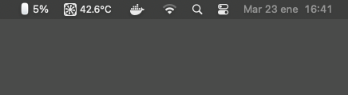

# Magic Mouse Battery Monitor

## Overview

The Magic Mouse Battery Monitor is a simple utility for macOS that displays the current battery percentage of a Magic Mouse in the macOS menu bar. The discreet icon serves as a visual indicator of the Magic Mouse's battery status. The project utilizes the `rumps` library for handling the menu bar icon and `pm2` (Optional) for process management, ensuring the application runs continuously in the background.



## Features

- Displays the real-time battery percentage of a Magic Mouse in the macOS menu bar.
- Uses a discreet icon to indicate the battery status.
- No intrusive notifications; the application runs silently in the background.
- Utilizes `rumps` for seamless integration with the menu bar.
- Uses `pm2` for process management to ensure continuous operation. (Optional)

## Requirements

- macOS (tested on macOS Sonoma 14.2)
- Magic Mouse
- Python (version 3.6+)
- [pm2](https://pm2.keymetrics.io/) (Optional)

## Run App

```bash
$ python3 battery_monitor.py
```

Recommended use PM2 for work on background.

```bash
$ pm2 start --name battery --no-autorestart battery_monitor.py

# Stop App
$ pm2 stop battery
```

## License

MIT license.
